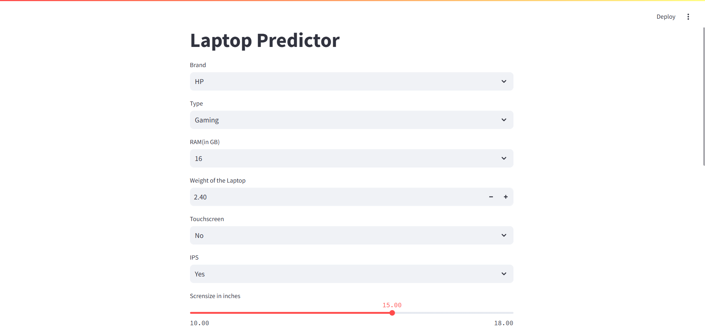
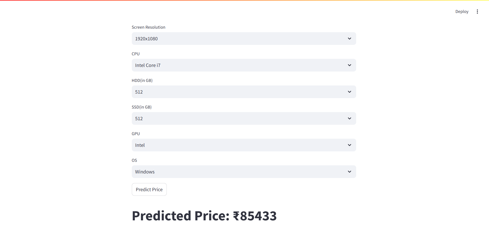

# Laptop Price Prediction using Multiple Machine Learning Models

## 📌 Project Overview

This project aims to predict laptop prices based on various features like RAM, processor, storage, brand, and more. The model is trained using multiple regression techniques to provide accurate price predictions.

## 🚀 Features

- Exploratory Data Analysis (EDA) performed to understand price distribution and feature impact.
- Multiple ML models compared and evaluated for performance.
- Streamlit-based web application for easy interaction with the model.
- Trained models stored using `pickle` for easy deployment.

## 📂 Project Structure

```
Laptop_Price_Predictor_using_ML/
│── data/
│   ├── laptop_data.csv  # Raw dataset
│
│── model/
│   ├── pipe.pkl  # Trained pipeline
│   ├── df.pkl  # Processed dataset
│
│── notebook/
│   ├── laptop_price_analysis.ipynb  # EDA & Model Training
│
│── app.py  # Streamlit App
│── .gitignore  
│── LICENSE  
│── README.md  
│── requirements.txt  # Dependencies
```

## 📊 Machine Learning Models Used

The following regression models were tested and evaluated:

- **Linear Regression**
- **Ridge Regression**
- **Lasso Regression**
- **K-Nearest Neighbors (KNN) Regressor**
- **Decision Tree Regressor**
- **Random Forest Regressor**
- **Gradient Boosting Regressor**
- **AdaBoost Regressor**
- **Extra Trees Regressor**
- **Support Vector Regressor (SVR)**
- **XGBoost Regressor**

## 📈 Model Evaluation

Each model was evaluated using performance metrics such as:

- **Mean Absolute Error (MAE)**
- **Mean Squared Error (MSE)**
- **R-Squared Score (R²)**

## 🔧 Setup & Installation

### 1️⃣ Clone the Repository

```sh
git clone https://github.com/your_username/Laptop_Price_Predictor.git
cd Laptop_Price_Predictor
```

### 2️⃣ Create & Activate Virtual Environment

```sh
# Windows
python -m venv Svenv
Svenv\Scripts\activate

# macOS/Linux
python3 -m venv Svenv
source Svenv/bin/activate
```

### 3️⃣ Install Dependencies

```sh
pip install -r requirements.txt
```

### 4️⃣ Run the Streamlit App

```sh
streamlit run app.py
```

## 💡 Future Improvements

- Add deep learning models for better accuracy.
- Improve feature engineering for enhanced performance.
- Deploy the app using cloud services (AWS, GCP, etc.).

## 📜 License

This project is licensed under the MIT License.

---

**🚀 Contribute & Star the Repo if You Like It!** 🌟

## App Preview

Below is a preview of the Streamlit application:




